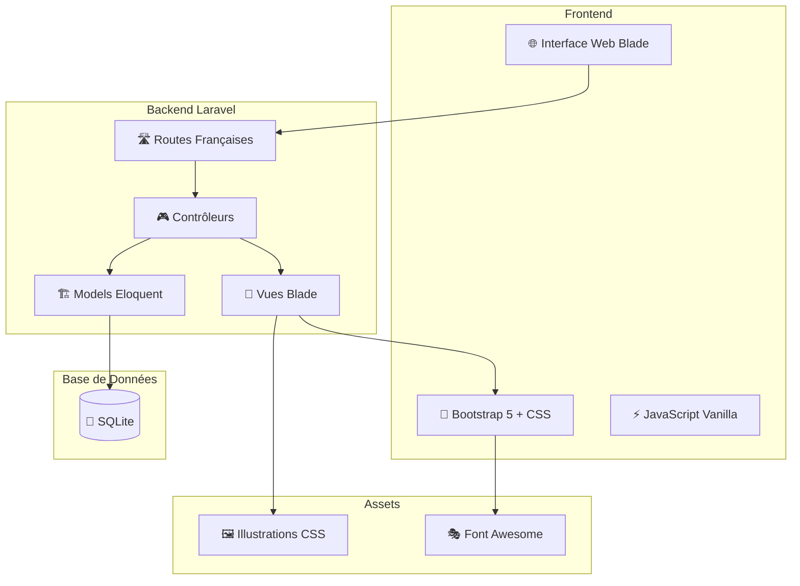
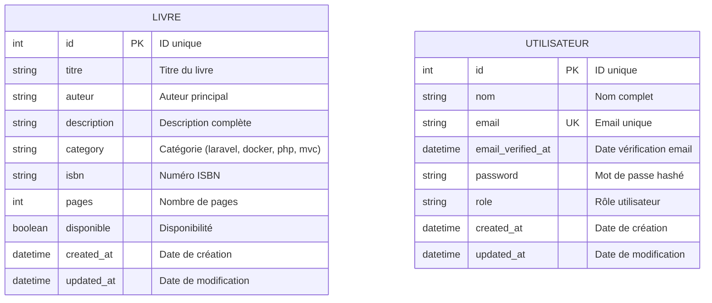

# 📚 BiblioTech - Formation Laravel BTS SIO SLAM


## 🎯 **À propos du Projet**

**BiblioTech** est une application de gestion de bibliothèque moderne développée avec Laravel, conçue spécialement pour la formation BTS SIO SLAM. Le projet couvre progressivement tous les aspects du développement web moderne : de l'architecture MVC aux technologies avancées (IA, WebSockets, QR Codes).

### **🎓 Public Cible**
- **Étudiants BTS SIO SLAM** - 2ème année
- **Formateurs** en développement web
- **Développeurs débutants** souhaitant apprendre Laravel
- **Professionnels** en reconversion

### **🎪 Objectifs d'Apprentissage**
1. **Maîtriser l'architecture MVC** avec Laravel
2. **Comprendre les bases de données** relationnelles
3. **Développer des interfaces** utilisateur modernes
4. **Intégrer des technologies** avancées (IA, WebSockets, etc.)
5. **Adopter les pratiques DevOps** (Docker, CI/CD, Tests)

### **🌟 Pourquoi une Bibliothèque ?**
Le domaine de la gestion de bibliothèque offre un contexte idéal pour l'apprentissage car il combine :
- **Entités simples à comprendre** : Livres, Utilisateurs, Emprunts
- **Relations claires** : Un utilisateur emprunte des livres
- **Fonctionnalités variées** : CRUD, recherche, authentification, notifications
- **Évolutions naturelles** : De la gestion simple aux fonctionnalités avancées

---

## 🚀 **Installation Rapide**

### **⭐ Option 1 : GitHub Codespace (Recommandé pour débuter)**

**Le plus simple pour commencer :**
1. 🌐 Rendez-vous sur le repository GitHub
2. 🔘 Cliquez sur **"< > Code"** → **"Codespaces"**  
3. ✨ Cliquez sur **"Create codespace on main"**
4. ⏳ Attendez 30 secondes que tout se configure automatiquement
5. 🎉 BiblioTech est prêt dans votre navigateur !

**Accès :** Onglet "PORTS" → clic sur l'icône 🌐 du port 8000

**Avantages :** ✅ Zéro installation ✅ Même environnement pour tous ✅ Accessible partout

📖 **[Guide Complet Codespace](docs/INSTALLATION-CODESPACE.md)**

---

### **⚡ Option 2 : Installation Locale Automatique**

**Scripts d'Installation Automatique :**

**Windows (le plus simple) :**
```bash
# Double-cliquer sur le fichier dans l'explorateur ou :
scripts\install.bat     # Installation complète
scripts\start.bat       # Démarrage du serveur
```

**Linux/Mac/WSL :**
```bash
bash scripts/install.sh    # Installation complète
bash scripts/start.sh      # Démarrage du serveur
```

**PowerShell (Windows) :**
```powershell
scripts\install.ps1        # Installation complète
scripts\start.ps1           # Démarrage du serveur
```

**Accès :** http://localhost:8000

---

### **🔧 Option 3 : Installation Manuelle**
```bash
# 1. Installer les dépendances
composer install

# 2. Configurer l'environnement
copy .env.example .env
php artisan key:generate

# 3. Créer la base SQLite
type nul > database\database.sqlite

# 4. Migrer la base de données
php artisan migrate

# 5. Démarrer le serveur
php artisan serve
```

**Accès :** http://localhost:8000

### **📖 Guides d'Installation Détaillés**

🌟 [Guide GitHub Codespace](docs/INSTALLATION-CODESPACE.md) - **Recommandé pour débuter**  
⚡ [Démarrage Rapide Local](docs/QUICK-START.md) - Installation en 2 minutes    
🏠 [Installation Locale Complète](docs/INSTALLATION-LOCAL.md) - Guide détaillé local  
🐳 [Docker (Optionnel)](docs/DOCKER-OPTIONS.md) - Containerisation avancée

**💡 Conseil :** Commencez par GitHub Codespace si c'est votre première fois avec Laravel !

---

## 📊 **Analyse des Cas d'Utilisation**

### **👥 Acteurs et Rôles**

#### **🌐 Visiteur (Non connecté)**
- ✅ Consulter le catalogue public (`/livres`)
- ✅ Rechercher des livres (`/recherche`)
- ✅ Voir les détails d'un livre (`/livre/{id}`)
- 🔄 S'inscrire au système *(Séance 3)*

#### **🔓 Utilisateur Connecté** *(Séances futures)*
- 🔄 Emprunter des livres
- 🔄 Gérer ses emprunts
- 🔄 Réserver des livres
- 🔄 Laisser des avis et notes
- 🔄 Recevoir des recommandations

#### **👨‍💼 Bibliothécaire** *(Séances avancées)*
- 🔄 Gérer le catalogue (CRUD livres)
- 🔄 Gérer les utilisateurs
- 🔄 Traiter les emprunts/retours
- 🔄 Générer des rapports

#### **🛡️ Administrateur** *(Séances avancées)*
- 🔄 Gérer les bibliothécaires
- 🔄 Configurer le système
- 🔄 Accéder aux analyses avancées
- 🔄 Maintenir l'application

---

## 🏗️ **Architecture du Système**

### **📐 Vue d'Architecture Générale**



### **🗄️ Modèle de Données Actuel (SQLite)**



### **📈 Relations Futures (Séances Avancées)**

| **Relation** | **Type** | **Description** |
|--------------|----------|------------------|
| Utilisateur → Emprunt | One-to-Many | Un utilisateur peut avoir plusieurs emprunts |
| Livre → Emprunt | One-to-Many | Un livre peut être emprunté plusieurs fois |
| Utilisateur → Reservation | One-to-Many | Un utilisateur peut réserver plusieurs livres |
| Livre → Reservation | One-to-Many | Un livre peut être réservé plusieurs fois |
| Utilisateur → Avis | One-to-Many | Un utilisateur peut laisser plusieurs avis |
| Livre → Avis | One-to-Many | Un livre peut recevoir plusieurs avis |
| Categorie → Livre | One-to-Many | Une catégorie contient plusieurs livres |

---

## 🎯 **Objectifs Pédagogiques**

### **Formation BTS SIO SLAM - 8 Séances Progressives**

| 🎓 Séance | 📚 Concepts Clés | 🛠️ Technologies | 🎯 Cas d'Utilisation | ✅ Status |
|-----------|------------------|------------------|----------------------|-----------|
| **S1** | MVC, Routes, Blade | Laravel, SQLite | Consultation catalogue, Recherche | **✅ Terminé** |
| **S2** | Base de données, Migrations | SQLite, Eloquent ORM | Gestion des données, Seeders | 🔄 Futur |
| **S3** | CRUD, Formulaires | Validation, Sessions, Flash Messages | Inscription, Profil utilisateur | 🔄 Futur |
| **S4** | Authentification, Sécurité | Laravel Auth, Middleware | Connexion, Rôles, Permissions | 🔄 Futur |
| **S5** | Relations, APIs | Relations Eloquent, API REST | Emprunts, Réservations, Relations | 🔄 Futur |
| **S6** | Recherche, Performance | Cache, Queues, Optimisation | Recherche avancée, Performance | 🔄 Futur |
| **S7** | Technologies Avancées | QR Codes, WebSockets, IA | Recommandations, Temps réel | 🔄 Futur |
| **S8** | Déploiement, Production | CI/CD, Monitoring, Scalabilité | Monitoring, Métriques, Déploiement | 🔄 Futur |

---

## 🌐 **Routes et Contrôleurs Implémentés**

| Route | Méthode | Description | Contrôleur | Concept Pédagogique |
|-------|---------|-------------|------------|---------------------|
| `/` | GET | Page d'accueil avec statistiques | `AccueilController@index` | Passage de données aux vues |
| `/livres` | GET | Liste des livres disponibles | `LivreController@index` | Collections et boucles |
| `/livre/{id}` | GET | Détail d'un livre spécifique | `LivreController@show` | Paramètres d'URL |
| `/recherche` | GET | Formulaire de recherche | `LivreController@search` | Traitement de formulaires |
| `/about` | GET | Page à propos | Vue directe | Routes simples |
| `/test` | GET | Test de fonctionnement | Closure | Routes de debug |

### **Terminologie Française**
- **"Livres"** au lieu de "Books"
- Contrôleurs : `LivreController`, `AccueilController`
- Variables : `$livres`, `$totalLivres`, `$livresEnVedette`
- Méthodes : `livresEnVedette()`, `rechercherLivres()`

---

## 📚 **Structure du Projet**

```
bibliotech-laravel/
├── 📂 app/
│   ├── 📂 Http/Controllers/     # Contrôleurs Laravel
│   │   ├── AccueilController.php  # Page d'accueil avec statistiques
│   │   └── LivreController.php    # Gestion des livres (CRUD)
│   ├── 📂 Models/              # Modèles Eloquent (futurs)
│   └── 📂 Services/            # Services métier (futurs)
├── 📂 database/
│   ├── database.sqlite         # Base de données SQLite
│   ├── 📂 migrations/          # Migrations Laravel par défaut
│   ├── 📂 seeders/            # Données de test (futurs)
│   └── 📂 factories/          # Factories pour les tests (futurs)
├── 📂 resources/
│   ├── 📂 views/              # Templates Blade
│   │   ├── 📂 livres/         # Vues des livres
│   │   │   ├── index.blade.php  # Liste des livres
│   │   │   ├── show.blade.php   # Détail d'un livre
│   │   │   └── search.blade.php # Recherche de livres
│   │   ├── 📂 layouts/        # Templates de base
│   │   │   └── app.blade.php    # Layout principal avec Bootstrap
│   │   ├── 📂 components/     # Composants réutilisables
│   │   │   └── livre-card.blade.php # Carte de livre
│   │   ├── welcome.blade.php    # Page d'accueil
│   │   └── about.blade.php      # Page à propos
│   ├── 📂 css/               # Styles CSS personnalisés
│   └── 📂 js/                # JavaScript (futurs)
├── 📂 routes/
│   ├── web.php               # Routes web 
│   └── api.php               # Routes API (futurs)
├── 📂 scripts/
│   ├── install.bat           # Installation automatique Windows
│   ├── start.bat             # Démarrage complet
│   ├── start-simple.bat      # Démarrage rapide
│   └── diagnostic.bat        # Diagnostic d'erreurs
├── 📂 docs/                  # Documentation pédagogique
│   ├── 📂 seance-01/         # Documentation Séance 1
│   ├── QUICK-START.md        # Guide de démarrage rapide
│   └── EXERCICES.md          # Exercices pratiques
├── 📂 .env                   # Configuration environnement
├── composer.json             # Dépendances PHP
└── README.md                 # Cette documentation
```

---

## 🛠️ **Technologies et Concepts Utilisés**

### **🎯 Stack Principal**
- **Framework** : Laravel 12.x ✅
- **Langage** : PHP 8.3+ ✅
- **Base de données** : SQLite 3 ✅ (PostgreSQL en Séance 2)
- **Frontend** : Blade Templates + Bootstrap 5 ✅
- **Styles** : CSS personnalisé avec illustrations ✅
- **Icons** : Font Awesome ✅

### **📦 Dépendances Clés**
- **laravel/framework** : Framework principal ✅
- **laravel/sanctum** : Authentification API (Séance 4)
- **spatie/laravel-permission** : Gestion des rôles (Séance 4)
- **barryvdh/laravel-debugbar** : Debug en développement

### **🔧 Fonctionnalités Actuelles**
- ✅ **Architecture MVC** complète
- ✅ **Routes françaises** (`/livres`, `/livre/{id}`)
- ✅ **Contrôleurs français** avec données statiques
- ✅ **Vues Blade** localisées avec Bootstrap
- ✅ **Illustrations CSS** pour les couvertures de livres
- ✅ **Base SQLite** configurée et migrée
- ✅ **Scripts d'installation** automatisés

### **🎨 Système d'Illustrations CSS**
- **Laravel** : Dégradé orange (#FF6B35 → #F7931E) avec icône
- **Docker** : Dégradé bleu (#0EA5E9 → #0284C7) avec icône
- **MVC/PHP** : Dégradé violet (#8B5CF6 → #7C3AED) avec icône
- **Défaut** : Dégradé gris (#6c757d → #495057) avec icône

**Avantages :**
- ✅ Chargement instantané (pas d'images externes)
- ✅ Design cohérent et professionnel
- ✅ Responsive et accessible
- ✅ Titre du livre visible sur chaque couverture

---

## 🎓 **Apprentissage - Séance 1 Complétée**

### **Concepts Laravel Maîtrisés**
- [x] **Routage** : Routes nommées, paramètres d'URL
- [x] **Contrôleurs** : Méthodes avec passage de données
- [x] **Vues Blade** : Templates, layouts, composants
- [x] **Architecture MVC** : Séparation des responsabilités
- [x] **Configuration** : Environnement, base de données SQLite

### **Code Exemple - Contrôleur Livre**
```php
class LivreController extends Controller
{
    public function index()
    {
        $livres = $this->obtenirLivres();
        $totalLivres = count($livres);
        
        return view('livres.index', compact('livres', 'totalLivres'));
    }
    
    public function show($id)
    {
        $livre = $this->obtenirLivreParId($id);
        $livresSimilaires = $this->obtenirLivresSimilaires($livre['category']);
        
        return view('livres.show', compact('livre', 'livresSimilaires'));
    }
}
```

---

## 🔧 **Scripts et Outils**

| Script | Description | Usage |
|--------|-------------|-------|
| `scripts\install.bat` | Installation complète avec vérifications | Double-clic ou `.\scripts\install.bat` |
| `scripts\start-simple.bat` | Démarrage rapide du serveur | Double-clic ou `.\scripts\start-simple.bat` |
| `scripts\start.bat` | Démarrage avec vérifications avancées | Double-clic ou `.\scripts\start.bat` |
| `scripts\diagnostic.bat` | Diagnostic des erreurs courantes | Double-clic ou `.\scripts\diagnostic.bat` |

### **Commandes Laravel Essentielles**
```bash
# Démarrage du serveur
php artisan serve

# Nettoyage du cache
php artisan optimize:clear

# Migration de la base
php artisan migrate

# Génération de clé
php artisan key:generate
```

---

## 🐛 **Troubleshooting**

### **Erreurs Courantes et Solutions**

#### **"Could not open input file: artisan"**
```bash
# Vérifiez le répertoire courant
cd bibliotech-laravel
php artisan serve
```

#### **Erreur de base de données SQLite**
```bash
# Recréez la base SQLite
del database\database.sqlite
type nul > database\database.sqlite
php artisan migrate
```

#### **Erreur Vite Manifest (Résolue)**
```bash
# Cette erreur est résolue dans ce projet
# Les références @vite ont été supprimées
# Utilisation de Bootstrap via CDN
```

#### **Page blanche ou erreur 500**
```bash
# Activez le mode debug dans .env
APP_DEBUG=true

# Nettoyez le cache
php artisan optimize:clear

# Vérifiez les logs
tail storage/logs/laravel.log
```


---

## 🚀 **Évolutions Futures**

### **Fonctionnalités Planifiées**
- 🔄 **CRUD Complet** : Création, modification, suppression de livres
- 🔄 **Authentification** : Connexion utilisateurs et bibliothécaires
- 🔄 **Système d'Emprunt** : Gestion des emprunts et retours
- 🔄 **Réservations** : Système de réservation en ligne
- 🔄 **Avis et Notes** : Système d'évaluation des livres
- 🔄 **Notifications** : Alertes par email et WebSocket
- 🔄 **API REST** : Accès programmatique aux données
- 🔄 **Interface Admin** : Tableau de bord pour bibliothécaires

---

## 🤝 **Contribution et Support**

### **💡 Comment Contribuer**
1. **Fork** le projet
2. **Créer une branche** pour votre feature (`git checkout -b feature/AmazingFeature`)
3. **Commiter** vos changements (`git commit -m 'Add some AmazingFeature'`)
4. **Push** vers la branche (`git push origin feature/AmazingFeature`)
5. **Ouvrir une Pull Request**

### **🆘 Support**
- **Issues GitHub** : Pour les bugs et demandes de fonctionnalités
- **Discussions** : Pour les questions générales et l'aide

---

## 📄 **Licence**

Ce projet est sous licence Creative Commons BY-SA 3.0. Voir le fichier [LICENSE](LICENSE) pour plus de détails.

---

**🎯 Prêt à apprendre Laravel avec BiblioTech ? Lancez `scripts\start-simple.bat` !**

*✨ Version Laravel 12 - Formation BTS SIO SLAM - Séance 1 Complétée - 2025*

[](http://localhost:8000)
[](docs/)
[](scripts/)
