# 🔧 Optimisations Appliquées - Séance 3

**Date :** 3 octobre 2025  
**Objectif :** Peaufiner le contenu et assurer la cohérence inter-séances

---

## 📊 **Analyse de Cohérence Effectuée**

### **✅ Transition Séance 2 → Séance 3**
- **Prérequis validés** : Models et Database de séance 2 correctement utilisés
- **Progression logique** : Database/Models → Controllers/Views
- **Relations simples** : Livre→Catégorie (One-to-Many) maintenue

### **✅ Préparation Séance 3 → Séance 4**
- **Base solide** : CRUD complet avec contrôleurs resource
- **Évolution préparée** : Champ `auteur` string → Modèle Auteur (relations Many-to-Many)
- **Évaluation** : Introduction du concept Auteur pour préparer séance 4

---

## 🔧 **Optimisations Appliquées**

### **1. Clarification de la Progression**
**Fichier :** `01-CONCEPTS-CONTROLLERS-VIEWS.md`
- ✅ Ajout mention séance 4 dans la progression
- ✅ Clarification : relations simples → relations avancées

### **2. Notes de Transition**
**Fichier :** `04-TP-PRATIQUE-CONTROLLERS.md`
- ✅ Ajout commentaires explicatifs sur champ `auteur`
- ✅ Préparation conceptuelle pour transformation en relation

### **3. Optimisation Temporelle**
**Fichier :** `05-TP-PRATIQUE-EXERCICES.md`
- ✅ Durée réajustée : 12min → 15min par module (plus réaliste)
- ✅ Durée totale : 60min → 75min
- ✅ Recommandation : choix de 3-4 modules selon niveau

### **4. Contextualisation Pédagogique**
**Fichier :** `06-EVALUATION-COMPETENCES.md`
- ✅ Ajout note explicative sur l'introduction du modèle Auteur
- ✅ Lien avec préparation séance 4

---

## 🎯 **Cohérence Inter-Séances Assurée**

```mermaid
graph LR
    S1[Séance 1<br/>Routes & Base] --> S2[Séance 2<br/>Models & DB]
    S2 --> S3[Séance 3<br/>Controllers & Views]
    S3 --> S4[Séance 4<br/>Relations Avancées]
    
    S2 -.->|Livre→Catégorie| S3
    S3 -.->|Auteur String→Model| S4
```

### **Progression Validée :**
- **Séance 2** : Relation simple (One-to-Many) Livre→Catégorie
- **Séance 3** : CRUD complet, champ auteur string (transitoire)
- **Séance 4** : Relations Many-to-Many, modèle Auteur dédié

---

## ✅ **Résultat Final**

### **Points Forts Conservés :**
- Documentation complète et structurée
- Exercices progressifs et évaluation cohérente
- Architecture MVC respectée

### **Améliorations Apportées :**
- Cohérence temporelle des exercices
- Préparation explicite pour séance 4
- Notes pédagogiques clarificatrices

### **Prêt pour :**
- ✅ Utilisation en cours BTS SIO
- ✅ Transition fluide vers séance 4
- ✅ Adaptation selon niveau des étudiants

**🚀 La séance 3 est optimisée et prête !**